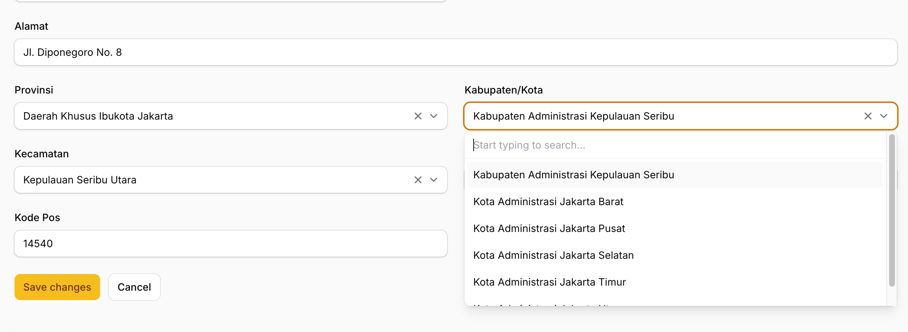

# Nusa Filament

[](https://github.com/VernSG/nusa-filament/actions/workflows/ci.yml?query=branch%3Amain)
[](https://packagist.org/packages/vernsg/nusa-filament)
[](https://packagist.org/packages/vernsg/nusa-filament)
[](LICENSE.md)

Ready-to-use Filament 4 components for Indonesian administrative regions, powered by [`creasi/laravel-nusa`](https://github.com/creasico/laravel-nusa).

`vernsg/nusa-filament` helps you build Indonesian address forms in Filament using cascading **Provinsi → Kabupaten/Kota → Kecamatan → Desa/Kelurahan** selects, automatic postal code filling, readable table columns, location filters, infolist entries, and validation rules.

## Preview



Dependent selects immediately display available child regions after a parent region is selected, while remote search remains available for larger datasets.

## Features

- Cascading Indonesian administrative region selects for Filament forms.
- Immediate child options after selecting a parent region, with remote search support.
- Full address form group with sensible default field names.
- Automatic postal code filling from the selected village.
- Table columns that display readable region names from stored region codes.
- Location filter for province, regency, district, and village fields.
- Infolist entries for readable address display.
- Laravel validation rules for valid region codes and address hierarchy consistency.
- Configurable labels, field names, search limit, and native select behavior.

## Compatibility

| Package Version | PHP | Laravel | Filament |
|---|---:|---:|---:|
| `^0.1` | `^8.2` | `^11.0 \| ^12.0` | `^4.0` |

This package also requires the PHP `sqlite3` extension.

Laravel Nusa stores its administrative region dataset in SQLite, so the `sqlite3` extension must be enabled in the application that installs this package.

## Installation

Install the package with Composer:

```bash
composer require vernsg/nusa-filament
```

Laravel package auto-discovery registers the service provider automatically.

Publish the configuration file when you need to customize field names, labels, search limits, or native select behavior:

```bash
php artisan vendor:publish --tag=nusa-filament-config
```

The published configuration file will be available at:

```text
config/nusa-filament.php
```

## Quick Start

Use `NusaAddress` in a Filament resource form when you want the complete address block:

```php
use Filament\Schemas\Schema;
use Vernsg\NusaFilament\Forms\Components\NusaAddress;

public static function form(Schema $schema): Schema
{
    return $schema
        ->components([
            NusaAddress::make(),
        ]);
}
```

By default, the component uses these model attributes:

```text
address_line
province_code
regency_code
district_code
village_code
postal_code
```

## Database Columns

This package stores administrative region **codes**, not region names. Region names can later be displayed using the provided Filament table columns and infolist entries.

Example migration:

```php
use Illuminate\Database\Schema\Blueprint;
use Illuminate\Support\Facades\Schema;

Schema::table('addresses', function (Blueprint $table): void {
    $table->text('address_line')->nullable();
    $table->string('province_code')->nullable();
    $table->string('regency_code')->nullable();
    $table->string('district_code')->nullable();
    $table->string('village_code')->nullable();
    $table->string('postal_code', 10)->nullable();
});
```

## How Dependent Selects Work

The address selects are dependent and reactive by default:

- selecting a province loads its regencies;
- selecting a regency loads its districts;
- selecting a district loads its villages;
- selecting a village can automatically fill the postal code field.

Options are immediately available after a parent region is selected. For example, after selecting a province, the regency dropdown directly displays matching regencies without requiring the user to type first.

Remote search remains enabled for filtering larger option lists.

## Naming Convention

The package uses English names in its PHP API while displaying Indonesian labels by default:

| Indonesian Label | Component / API Term |
|---|---|
| Provinsi | Province |
| Kabupaten/Kota | Regency |
| Kecamatan | District |
| Desa/Kelurahan | Village |

## Forms

### Full Address Group

```php
use Vernsg\NusaFilament\Forms\Components\NusaAddress;

NusaAddress::make();
```

Customize field names when your model uses different columns:

```php
NusaAddress::make()
    ->addressLine('shipping_address')
    ->province('shipping_province_code')
    ->regency('shipping_regency_code')
    ->district('shipping_district_code')
    ->village('shipping_village_code')
    ->postalCode('shipping_postal_code');
```

Hide optional fields:

```php
NusaAddress::make()
    ->withoutAddressLine()
    ->withoutPostalCode();
```

### Individual Selects

Use the individual components when you want to place fields manually:

```php
use Vernsg\NusaFilament\Forms\Components\DistrictSelect;
use Vernsg\NusaFilament\Forms\Components\ProvinceSelect;
use Vernsg\NusaFilament\Forms\Components\RegencySelect;
use Vernsg\NusaFilament\Forms\Components\VillageSelect;

ProvinceSelect::make('province_code');

RegencySelect::make('regency_code')
    ->provinceField('province_code');

DistrictSelect::make('district_code')
    ->regencyField('regency_code');

VillageSelect::make('village_code')
    ->districtField('district_code')
    ->fillPostalCode('postal_code');
```

## Tables

Display readable region names from stored codes:

```php
use Vernsg\NusaFilament\Tables\Columns\DistrictColumn;
use Vernsg\NusaFilament\Tables\Columns\ProvinceColumn;
use Vernsg\NusaFilament\Tables\Columns\RegencyColumn;
use Vernsg\NusaFilament\Tables\Columns\VillageColumn;

return $table
    ->columns([
        ProvinceColumn::make('province_code'),
        RegencyColumn::make('regency_code'),
        DistrictColumn::make('district_code'),
        VillageColumn::make('village_code'),
    ]);
```

Add a dependent location filter:

```php
use Vernsg\NusaFilament\Tables\Filters\NusaLocationFilter;

return $table
    ->filters([
        NusaLocationFilter::make('location'),
    ]);
```

Customize filter field names:

```php
NusaLocationFilter::make('shipping_location')
    ->provinceField('shipping_province_code')
    ->regencyField('shipping_regency_code')
    ->districtField('shipping_district_code')
    ->villageField('shipping_village_code');
```

## Infolists

Use the complete address entry:

```php
use Vernsg\NusaFilament\Infolists\Components\NusaAddressEntry;

NusaAddressEntry::make();
```

Or use individual entries:

```php
use Vernsg\NusaFilament\Infolists\Components\DistrictEntry;
use Vernsg\NusaFilament\Infolists\Components\ProvinceEntry;
use Vernsg\NusaFilament\Infolists\Components\RegencyEntry;
use Vernsg\NusaFilament\Infolists\Components\VillageEntry;

ProvinceEntry::make('province_code');
RegencyEntry::make('regency_code');
DistrictEntry::make('district_code');
VillageEntry::make('village_code');
```

## Validation

Use the provided validation rules to validate individual region codes and ensure that the selected address hierarchy is valid:

```php
use Vernsg\NusaFilament\Rules\NusaRules;

[
    'province_code' => ['required', NusaRules::province()],
    'regency_code' => ['required', NusaRules::regency()],
    'district_code' => ['required', NusaRules::district()],
    'village_code' => [
        'required',
        NusaRules::village(),
        NusaRules::addressHierarchy(),
    ],
]
```

`addressHierarchy()` validates that:

- the regency belongs to the selected province;
- the district belongs to the selected regency;
- the village belongs to the selected district.

## Configuration

Publish the configuration file:

```bash
php artisan vendor:publish --tag=nusa-filament-config
```

Available options:

```php
return [
    'fields' => [
        'province' => 'province_code',
        'regency' => 'regency_code',
        'district' => 'district_code',
        'village' => 'village_code',
        'postal_code' => 'postal_code',
        'address_line' => 'address_line',
    ],

    'labels' => [
        'province' => 'Provinsi',
        'regency' => 'Kabupaten/Kota',
        'district' => 'Kecamatan',
        'village' => 'Desa/Kelurahan',
        'postal_code' => 'Kode Pos',
        'address_line' => 'Alamat',
    ],

    'search_limit' => 50,

    'native' => false,
];
```

## Development

Install dependencies:

```bash
composer install
```

Run the test suite:

```bash
composer test
```

Run static analysis:

```bash
composer analyse
```

Check code style:

```bash
composer format:test
```

Fix code style:

```bash
composer format
```

## Changelog

Please see [CHANGELOG.md](CHANGELOG.md) for notable changes.

## Contributing

Please see [CONTRIBUTING.md](CONTRIBUTING.md) for contribution guidelines.

## Security

Please see [SECURITY.md](SECURITY.md) for the security policy.

## Credits

- [`creasi/laravel-nusa`](https://github.com/creasico/laravel-nusa) for the Indonesian administrative region data and underlying region support.
- [Filament](https://filamentphp.com/) for the application panel and component framework.

## License

The MIT License. Please see [LICENSE.md](LICENSE.md) for details.